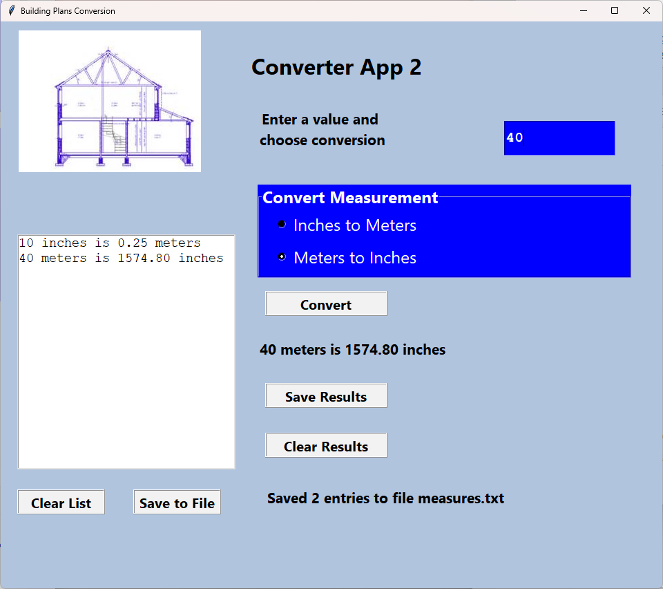
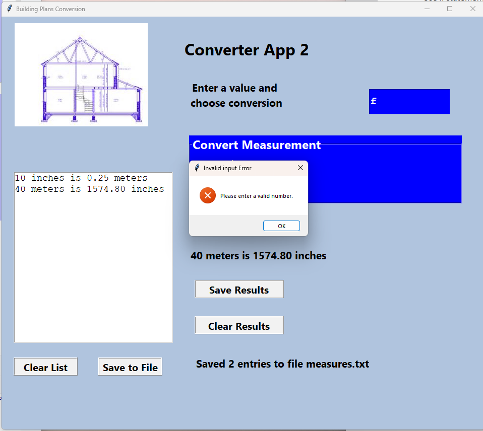

# Final - Building Plans Conversion

Author: John Morales
Class: GUI Development

## Tools
* Python PAGE - https://page.sourceforge.net/
* PyCharm Professional

## Issues
* Changed my git work flow to do development on a seperate feature branch. Finished the app and then lost all changes when trying to merge the feature branch into main. Had to redo everything but it was fast since I remembered most of the code written.